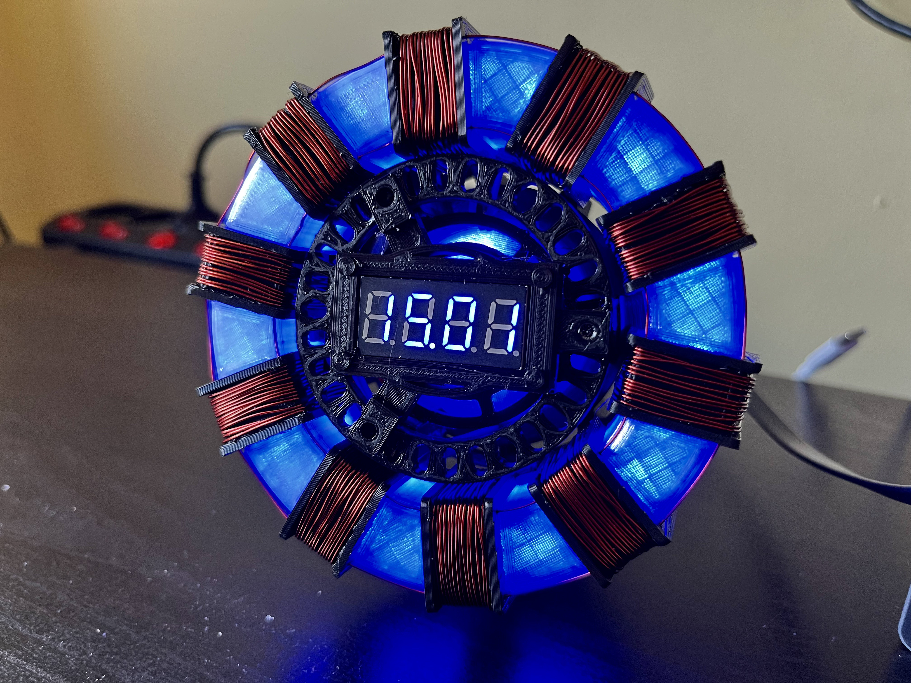
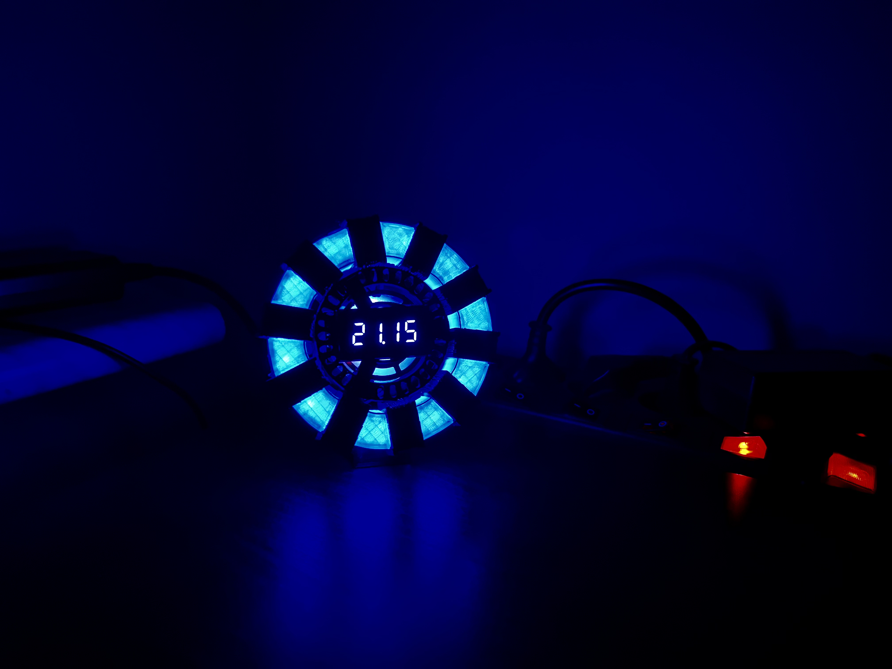

# Iron man clock
This project is based on: https://www.thingiverse.com/thing:6063303

The repository was created due to the change of the script executing the program, the change of the LED ring, which made it necessary to change one element.

## List of components
- [Mini display 0.36'](https://pl.aliexpress.com/item/1005001566508703.html?spm=a2g0o.order_list.order_list_main.5.3f171c24MeULNV&gatewayAdapt=glo2pol)
- [RGB ring with 24 LEDs](https://pl.aliexpress.com/item/1005002287819725.html?spm=a2g0o.productlist.main.5.371c6de9FedAbL&algo_pvid=bc6aee09-cba4-451b-8329-609e76c64efa&aem_p4p_detail=202308210227338347761143640000005337106&algo_exp_id=bc6aee09-cba4-451b-8329-609e76c64efa-2&pdp_npi=4%40dis%21PLN%2116.36%2115.24%21%21%2128.49%21%21%4021038ede16926100536802752ef4ca%2112000034777035710%21sea%21PL%212248386321%21&curPageLogUid=8zang06EKueJ&search_p4p_id=202308210227338347761143640000005337106_3)
- [D1 Mini ESP32](https://pl.aliexpress.com/item/1005001621844145.html?spm=a2g0o.productlist.main.3.669b2f34rL2moO&algo_pvid=fb66959c-f8ba-4b5d-8a84-040183954a06&aem_p4p_detail=202308210228522813267887471440012963692&algo_exp_id=fb66959c-f8ba-4b5d-8a84-040183954a06-1&pdp_npi=4%40dis%21PLN%2115.56%2115.56%21%21%213.70%21%21%4021038ede16926101322923533ef4ca%2112000024507146988%21sea%21PL%212248386321%21&curPageLogUid=RdoWPbEev0Xc&search_p4p_id=202308210228522813267887471440012963692_2)
- Black and transparent filament for 3D printer
- Copper wire 0.5mm

## Changes in parts
I changed the LED ring to a smaller one due to availability in my country. As a result, its circumference decreased and did not fit the original parts. If you prefer to stay with the default number of LEDs (35 pieces), you can print as designed. However, if you prefer to change the number of LEDs to 24 pieces (as I did), it is necessary to print all elements at 95% of the size.

Then, however, there will be problems with two parts. Part_1 will not fit the size of the ESP32. Here I drilled a hole on one side to insert the button that blocked the mounting of the plate.

The second problem is with the display (Part_9), it will not fit the original item. As part of that, I redrawn it, widening the hole it's supposed to go in. You can find the STL file here: [Display clock holder](display_clock_holder.stl).

The rest of the parts are ok.

## Changes in code
The code has been changed due to incorrect operation and hard codes on the number of leds. I also wanted to make the code look cleaner.

The animations that occur every hour have also been changed (shown below) due to preference.

Link to original code: https://github.com/jejelinge/IRON_MAN_ARC_REACTOR

## Animations
### Clock startup

### Every hour animation

